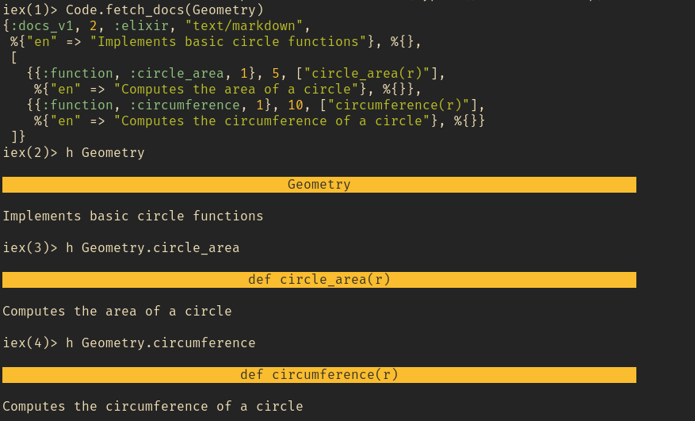

## Oficial Documentation of Elixir

https://elixir-lang.org/

## Installation

#### macOS

* Using Homebrew:
```
brew update
brew install elixir
```
* Using Macports:
 ```
sudo port install elixir
 ```
#### GNU/Linux

* Arch Linux (Community repository)
```
pacman -S elixir
```

* Ubuntu 14.04/16.04/17.04/18.04/19.04 or Debian 7/8/9/10

```
wget https://packages.erlang-solutions.com/erlang-solutions_2.0_all.deb
sudo dpkg -i erlang-solutions_2.0_all.deb
sudo apt-get update
sudo apt-get install esl-erlang
sudo apt-get install elixir
```

## Variables Names

In Elixir, a variable name always starts with a lowercase alphabetic character or an
underscore. After that, any combination of alphanumerics and underscores is allowed.
The prevalent convention is to use only lowercase ASCII letters, digits, and underscores:
* valid_variable_name
* also_valid_1
* validButNotRecommended
* NotValid

Variable names can also end with the question mark (?) or exclamation mark (!)
characters:
* valid_name?
* also_ok!

## Arity and default arguments

```elixir
defmodule Geometry
  def area(a) do: a * a

  def area(a, b) do: a * b
end
```

* Functions with the same name but different arities are different function!
* You can pass default values to a function with the **\\** notation after the argument

```elixr
defmodule Math do
  def add(a, b \\ 0, c \\ 0, d \\0) do
    a + b + c + d
  end
end
```

## Private methods

* You can also declare a function as private with the **defp** notation

``` elixir
defmodule PrivateTest do
  def not_private do
    'A public return value'
  end

  defp private do
    'a secret return value'
  end
end
```

* Running **PrivateTest.not_private** will return:

```elixir
  iex(n) > PrivateTest.not_private
  'A public return value'
  iex(n+1) > PrivateTest.private
  ** (UndefinedFunctionError) function PrivateTest.private/0 is undefined or private. Did you mean one of:

    * not_private/0

  PrivateTest.private()
```

## Mixing modules

* you can import other modules to a new module with the **import** keyword
* Note that you don't need to call **IO.puts()** in the example given, but just puts()
*
```elixir
  defmodule MyModule do
    import IO

    def my_function do
      puts 'Calling imported method'
    end

  end
```

## Aliases

```
iex(n) > alias IO, as: MyAwesomeAlias
iex(n) > MyAwesomeAlias.puts('That was an alias')
'That was an alias'
:ok
```

## Modules atributes

* very similar to the ruby Sintax

```elixir
  defmodule Geometry do
    @moduledoc "Implements basic circle functions"
    @pi 3.14159

    @doc "Computes the area of a circle"
    def circle_area(r) do
      r*r*@pi
    end

    @doc "Computes the circumference of a circle"
    def circumference(r) do
      2*r*@pi
    end
  end
```

* You can add the **@moduledoc** and **@doc** attributes and if you compile the code and load it in the *iex* then you get the documentation spelled out with the **Code.fetch_docs(Module_name)** method




